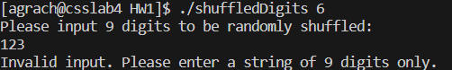

# HW1 
## Shuffled Digits

This program takes a 1 command line argument, which represents the total number of shuffles it will print out, assuming it is <= 10.
Then the program takes the string of 9 digits through console input. It prompts the user to type in the string of 9 digits without spaces or any other characters between each digit. Otherwise it prints an error message.
The program then randomly shuffles the 9 digits and prints them in 3x3 format.

Below is the output of this program showing the command line argument as 2, and the 9 digits user input as “123456789”, and the corresponding output:

Another example of the output is when the user inputs incorrect number of digits:

Finally, the screenshot showing the output when the number of shuffles is 6 and the user input is correct. The number of shuffle is spelled out instead of a number:

